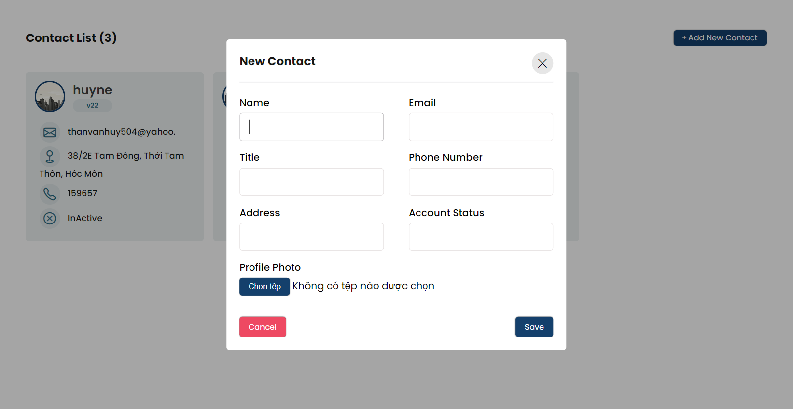

# Project



## Installation

### Backend (Spring Boot)
To set up the backend of the application, follow these steps:

1. **Clone the repository:**
    ```bash
    git clone https://github.com/Vanhuyne/Contact-API.git
    ```

2. **Navigate to the backend directory:**
    ```bash
    cd back-end
    ```

3. **Install dependencies:**
    ```bash
    mvn install
    ```

4. **Start the server:**
    ```bash
    mvn spring-boot:run
    ```

### Frontend (React)
To set up the frontend of the application, proceed with the following steps:

1. **Clone the repository:**
    ```bash
    git clone https://github.com/Vanhuyne/Contact-API.git
    ```

2. **Navigate to the frontend directory:**
    ```bash
    cd front-end
    ```

3. **Install dependencies using npm or yarn:**
   ```bash
   npm install

